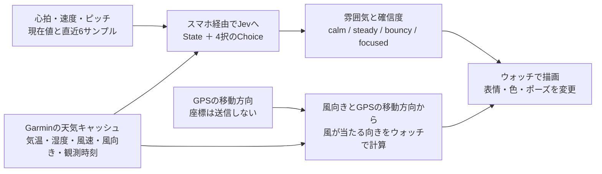

# Jev Buddy — 走りをキャラクターにする実験

Forerunner 265のラン画面に、小さなキャラクターを表示するConnect IQデータフィールドです。心拍・速度・ピッチと天気をJevへ渡し、返ってきた「雰囲気」に合わせて色・表情・ポーズを変えます。

補給の判断や疲労診断ではなく、**センサーデータに対するJevの反応を見て楽しむ試作**です。自分用のUSB転送で使い、中継サーバーもストア公開も必要ありません。

**初期状態は通信OFFのデモです。APIキーなしでキャラクターを見られます。** デモでは4種類を順に表示し、Jevが選んだ結果とは区別します。

## キャラクターの雰囲気

| Jevの選択 | 表現 |
| --- | --- |
| calm | 青い体、目を細めたのんびりした顔 |
| steady | 緑の体、足を交互に動かす姿 |
| bouncy | 黄色い体、手を上げて弾む姿 |
| focused | ピンクの体、眉を寄せた集中顔 |

JevのChoiceで4種類から1つを選びます。実APIの応答では、選択した雰囲気と確信度を表示します。確信度はキャラクター選択に対する値で、健康状態の確率ではありません。



[何を判定材料にして、Jevをどう使うか](docs/how-jev-works.md)に、送信条件・実際の選択肢・応答例をまとめています。

走行中は、ネット接続したスマートフォンを携帯する前提です。描画はウォッチ上で行い、アニメーションのフレームごとにAPIを呼ぶことはありません。動きはデータフィールドの更新頻度に合わせた、ゆっくりしたものです。

## 天気と風の表示

気温（°C）・湿度（%）・風速（m/s）を表示し、キャラクターの周りの矢印で風が来る方向を示します。**画面の上が進行方向**です。北へ走っているときの北風は上から、東へ走っているときの北風は左からキャラクターへ向かいます。方向は「前からの風」「右からの風」などの文字でも表示します。1項目のページで使う前提です。狭い分割レイアウトでは、矢印と天気の数値を省いて方向を文字で表示します。

天気はGarminが保持している観測データを60秒ごとに読み直します。アプリが毎分、新しい観測値を取得できるという意味ではありません。画面下に観測からの経過時間を表示します。自分で天気APIや中継サーバーを用意する必要はありません。

風の方向は、前後のGPS座標から移動方向が得られ、走行タイマーが動作中で、速度が1m/s以上のときに表示します。停止中・GPS精度が低いとき・観測時刻不明・6時間を超えた観測では矢印を隠します。5m以上の移動で方向を更新するため、曲がった直後は少し遅れて変わります。古い天気の数値は「古い観測」として残します。天気そのものが取れない項目は `--` です。

風向きは「風が吹いてくる方角」として扱っています。GarminのAPI資料には東西南北の角度は記載されていますが、吹いてくる向きか吹いていく向きかの明記はないため、実機での照合は残っています。周辺の観測値とGPSから求める目安で、木や建物による風の変化や、走ることで生じる体感風は反映しません。

座標を読むため、CIQの位置情報権限を使います。座標はウォッチのメモリ内だけで扱い、保存・送信しません。

Jevには天気と観測の古さ、進行方向、相対的な風向きを追加して渡します。風の矢印はウォッチで計算するため、Jevの返答を待たずに変わります。通信OFFのデモでも、天気と風は取得できた実データを表示します。4種類を順番に切り替えるデモはキャラクターの雰囲気だけです。

## 表示言語

ウォッチの言語が日本語なら、雰囲気・通信状態・確信度を日本語で表示します。英語表示も残しています。Jevへ送る選択肢のIDは共通で、表示言語によって判定内容は変えません。

## 開発環境を用意する

Nodeとpnpmの指定バージョンはpackage.jsonを参照してください。Garmin SDK・Java・Node・pnpm本体はこのリポジトリに含めていません。

```sh
git clone https://github.com/kuromoka/garmin-jev-buddy.git
cd garmin-jev-buddy
pnpm install
pnpm check
# SDKと署名鍵の準備後、CIQシミュレーターで通信制御をテストする
pnpm test:ciq
```

テストは外部APIを呼びません。ウォッチ向けのビルドには、下の「Forerunner 265向けにビルドする」で説明するSDK・Java・署名鍵が必要です。

## 自分のウォッチで使う

ストアを使わず、個人設定を含めた実行ファイルを作成します。サイドロードしたアプリは、スマホのConnect IQアプリから設定を変更できません。[Garmin公式FAQ](https://forums.garmin.com/developer/connect-iq/w/wiki/4/new-developer-faq#app-settings)

```sh
test -f .personal.json || cp .personal.example.json .personal.json
pnpm build:personal
# この開発環境では bash scripts/dev.sh build:personal でも実行できます。
```

`.personal.json` の `networkMode` が `offline` なら通信しません。Jevに接続するときは、次の設定へ変更します。

```json
{
  "networkMode": "jev",
  "requestIntervalSeconds": 60,
  "maxCallsPerSession": 120
}
```

`test -f .env || cp .env.example .env` でローカル設定ファイルを用意し、`.env` の `TYPESAFE_API_KEY` に自分のAPIキーを設定します。チャットやGitHubへキーを貼る必要はありません。環境変数にも同名の値がある場合は、環境変数を優先します。その後、`pnpm build:personal` を実行します。初回の通信確認では `maxCallsPerSession` を `1` にすると、送信を1回に制限できます。

| 個人設定 | 内容 |
| --- | --- |
| networkMode | `offline`（通信OFF）または `jev`（実API） |
| requestIntervalSeconds | 送信間隔。30〜600秒、初期値60秒 |
| maxCallsPerSession | セッション内の送信回数上限。1〜120回、初期値120回。失敗も数えます |

以前の `relayUrl` / `relayIntervalSeconds` は使いません。旧形式の `.personal.json` がある場合は、上の形式へ書き換えます。APIキーは個人用ビルドのPRGへ埋め込まれます。`.env`、`.personal.json`、生成したPRGはGit管理外です。PRGは自分のウォッチへの転送だけに使い、公開しないでください。

### Macから実機へ転送する

1. Forerunner 265をデータ転送できるUSBケーブルでMacに接続します。Garmin Expressが起動していたら終了します。
2. [OpenMTP](https://openmtp.ganeshrvel.com/)をインストールして開きます。Macからウォッチ内のファイルを扱うために使います。Finderにウォッチが表示されない場合も、OpenMTPで接続を確認してください。
3. リポジトリ内の `ciq/build/FuelGuide-personal.prg` を、ウォッチ側の `GARMIN/APPS` フォルダーへコピーします。転送するのは、このPRGファイル1つです。
4. 転送が完了してからUSB接続を解除します。
5. ウォッチで `UP長押し → アクティビティ＆アプリ → ラン → ラン設定 → トレーニングページ` を開きます。
6. カスタムデータページを追加し、レイアウトを1項目にします。データ項目の `Connect IQ → Jev Buddy` を選びます。表記はウォッチのソフトウェアによって異なる場合があります。

Jev Buddyはラン画面に追加するデータ項目です。独立したアプリとして起動する形式ではありません。通信OFFのビルドでは、`DEMO / NO API` と表示し、4種類のキャラクターを順に見せます。Jev連携を使うには、個人設定とAPIキーを設定して再ビルド・再転送します。

この転送手順は公式資料を基にしています。このプロジェクトでの実機転送はまだ未確認です。[Garmin公式のサイドロード案内](https://forums.garmin.com/developer/connect-iq/w/wiki/4/new-developer-faq)、[Forerunner 265のトレーニングページ設定](https://www8.garmin.com/manuals-apac/webhelp/forerunner265series/JA-JP/GUID-5FE174F6-2099-4194-AE6F-5806D91F94DF-2964.html)を参照してください。

個人設定・生成したリソース・実行ファイルはGit管理から除外します。通信を有効にした実行ファイルにはJevのAPIキーが入ります。設定変更後は再ビルド・再転送が必要です。

## Forerunner 265向けにビルドする

1. [Garmin公式SDK Manager](https://developer.garmin.com/connect-iq/sdk/)でログインし、SDKとForerunner 265の機種データを取得します。機種IDは `fr265` です。
2. SDKの場所と開発用署名鍵を設定します。SDK・署名鍵はリポジトリに含まれないため、自分の環境で用意します。SDK同梱のmonkeycを実行できるJava環境が必要です。
3. ビルドコマンドを実行します。

```sh
# CIQ_SDK_HOMEはbin/monkeycを含むSDKのディレクトリ
# SDK Managerの現在のSDK設定を自動検出します。
# 別の場所に置いた場合だけ CIQ_SDK_HOME を指定してください。
# 以下の鍵生成は .tools/developer_key.der がない場合だけ実行する。
# 既存の鍵を上書きせずに使用する。
mkdir -p .tools
if [ ! -f .tools/developer_key.der ]; then
  openssl genrsa -out .tools/developer_key.pem 4096
  openssl pkcs8 -topk8 -inform PEM -outform DER \
    -in .tools/developer_key.pem -out .tools/developer_key.der -nocrypt
  chmod 600 .tools/developer_key.*
fi
export CIQ_DEVELOPER_KEY="$PWD/.tools/developer_key.der"
pnpm build:ciq
```

生成先は `ciq/build/FuelGuide.prg` です。実機への転送とラン画面への追加は、ビルド成功後に行います。SDKのシミュレーターで先に確認し、実機では1フィールドのデータ画面に追加して表示を確認してください。署名鍵やAPIキーをリポジトリにコミットしないでください。

## Jevへ送るデータとタイミング

15〜20秒ほどのサンプルが集まり、現在の心拍・速度・ピッチのいずれかが取得できたら、初回の送信を試みます。その後は設定した間隔で新しいデータを送ります。走行タイマーの停止中は送信しません。

送るのは経過時間、心拍、速度、ピッチと直近6サンプルの履歴、気温・湿度・風速・風向き・観測からの経過時間・進行方向・相対的な風向きです。取得できない値は不明として扱います。GPS座標・観測地点の座標や名前・氏名・Garminアカウント情報は送りません。送信先は `https://api.typesafe.ai/v1/systemone` に固定しています。`networkMode: "jev"` ではTypeSafeへのデータ送信とAPI利用料が発生します。

同時に送るリクエストは1つに制限します。失敗も送信回数へ数え、同じデータを即座に再送しません。遅れた応答や一時停止前の応答は表示へ反映しません。回数上限はアプリ再起動などでリセットされるため、アカウント全体の課金上限にはなりません。

## 開発メモ

ウォッチ側はMonkey C、個人ビルドの準備はTypeScriptです。`pnpm check` で型チェックとNodeのテスト、`pnpm test:ciq` でシミュレーター上のMonkey Cテストを実行します。テストから実APIは呼びません。

PRG名は以前のFuel Guideから引き継いでいます。`relay/` は以前の補給ガイド試作の比較用コードで、現在のキャラクターアプリは使いません。

## 参考

- [Jev Quick start](https://docs.typesafe.ai/introduction/quickstart)
- [Choice](https://docs.typesafe.ai/primitives/choice)
- [Garmin Communications](https://developer.garmin.com/connect-iq/api-docs/Toybox/Communications.html)
- [Garmin DataField](https://developer.garmin.com/connect-iq/api-docs/Toybox/WatchUi/DataField.html)

## 確認状況

Nodeの型チェックと24件のテスト、CIQシミュレーターの17件のテスト、Forerunner 265向け個人ビルドが成功しました。英語・日本語の表示、天気キャッシュの読み取り、合成座標・速度を使った風向き計算から矢印描画までをシミュレーターで確認しています。GPX再生だけでの風向き表示は確認できていません。実Jev API接続、実機転送、実走行でのGPS方位と風向きの照合、電池消費は未確認です。

更新日: 2026-09-21
