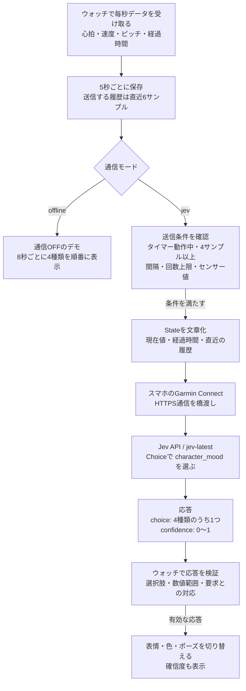

# Jevは何を見て、何を選ぶのか

Jev Buddyは、現在の心拍・速度・ピッチと直近の変化を文章にしてJevへ送り、キャラクターの雰囲気を4種類から選んでもらいます。画像生成は使いません。色・表情・ポーズはアプリに用意してあり、Jevが返した選択に合わせてウォッチが描画します。

## 全体の流れ



自分で用意する中継サーバーはありません。スマホは通信を橋渡しし、判定はJevのサーバー、描画はウォッチが担当します。デモではセンサー値から雰囲気を判定せず、順番に切り替えるだけです。

## 判定材料

| Stateに含めるもの | 内容 |
| --- | --- |
| heartRate | 現在の心拍、bpm |
| speedMps | 現在の速度、m/s。ペース表示へ換算した値ではありません |
| cadenceRpm | Garminが返す現在のピッチ、rpm。アプリ側で2倍にはしません |
| elapsedSeconds | アクティビティのタイマー経過時間、秒 |
| recentSamples | 5秒ごとに取った直近6件の時刻・心拍・速度・ピッチ。通常は約25秒の幅です |
| sampleCount / windowSeconds | ウォッチ内で保持しているサンプル数と時間幅。保持は最大120件で、送る履歴そのものは6件までです |
| sessionId / sequence | セッション識別子と送信番号。状態の識別用です |

心拍20〜250、速度0〜15、ピッチ0〜300の範囲外や欠損値は `unknown` として送ります。これは入力の異常を除くための範囲で、キャラクターを決めるしきい値ではありません。

気温・位置情報・年齢・最大心拍数・摂取履歴などは送りません。心拍ドリフトや疲労スコアも、このキャラクター版では計算していません。

## Jevへの問い

APIへは `model: "jev-latest"`、文字列の `state`、1つのChoice質問を渡します。質問は「観測したランニングデータから、遊びとしての見た目の雰囲気を選ぶ。健康・疲労の診断をせず、欠損値は不明として扱う」という内容です。

| Choiceの値 | Jevへ渡している基準 | ウォッチの日本語表示・見た目 |
| --- | --- | --- |
| calm | low motion or relaxed rhythm | のんびり：青い体、目を細めた顔 |
| steady | consistent motion and rhythm | いいリズム：緑の体、交互に動く足 |
| bouncy | lively or changing rhythm | はずむ：黄色い体、上げた手、上下の動き |
| focused | sustained purposeful movement | 集中：ピンクの体、寄せた眉、動く足 |

「心拍が何以上なら集中」のような固定ルールは書いていません。この4つの説明とStateを見て、Jevが選びます。結果はモデルの解釈であり、実際の気分や体調を測ったものではありません。

例えば、次のような応答を受け取った場合は黄色いキャラクターを表示します。これは形式を説明するための例で、実際の測定結果ではありません。

```json
{
  "answers": {
    "character_mood": {
      "type": "choice",
      "choice": "bouncy",
      "confidence": 0.78
    }
  }
}
```

画面の確信度78%は、この選択に対するJevの確信度です。健康状態や判定の正しさが78%という意味ではありません。現在は確信度の大小で表示を止めず、0〜1の有効な値なら表示します。モデルの反応を見るためです。

## 呼ぶ頻度と、応答を使わない場合

- 初回は4サンプル以上・15秒以上の履歴があり、現在の心拍・速度・ピッチのどれかが範囲内なら送信できます。通常は開始から15〜20秒ほどです。
- その後は初期値60秒間隔です。30〜600秒に設定でき、同時に送るのは1件だけです。
- 回数上限は初期値120回で、1〜120回に設定できます。失敗も回数に含めます。アプリの再起動や新しいセッションではリセットされます。
- 応答待ちは20秒までです。期限切れ、重複、一時停止前の応答、未知の選択肢、範囲外の確信度は反映しません。
- 成功した結果は、アクティビティのタイマーで180秒経つと古い結果として扱い、確信度を消して待機表示へ戻します。
- 通信OFFのデモはAPIを呼びません。表情の切り替えや足の動きもウォッチ側で描画するため、フレームごとのAPI呼び出しはありません。

## 実装と公式資料

- [送信するState・Choice・応答検証](../ciq/source/FuelGuideField.mc)
- [キャラクター描画](../ciq/source/BuddyRenderer.mc)
- [個人用ビルド設定](../scripts/prepare-personal.ts)
- [Jev APIの公式Quick start](https://docs.typesafe.ai/introduction/quickstart)
