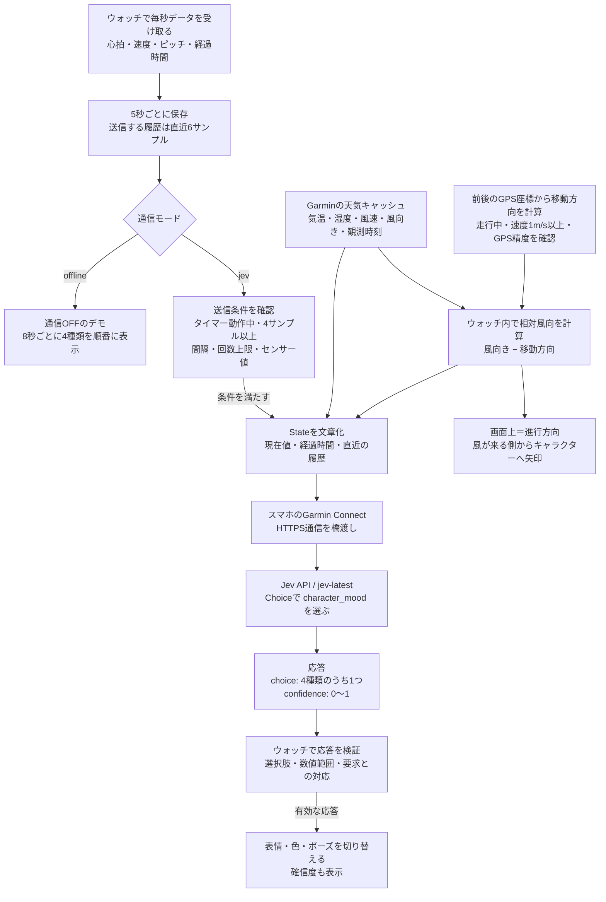

# Jevは何を見て、何を選ぶのか

Jev Buddyは、現在の心拍・速度・ピッチと直近の変化、取得できた天気を文章にしてJevへ送り、キャラクターの雰囲気を4種類から選んでもらいます。画像生成は使いません。色・表情・ポーズはアプリに用意してあり、Jevが返した選択に合わせてウォッチが描画します。

## 全体の流れ



自分で用意する中継サーバーはありません。スマホは通信を橋渡しし、判定はJevのサーバー、描画はウォッチが担当します。デモではセンサー値から雰囲気を判定せず、順番に切り替えるだけです。

## 判定材料

| Stateに含めるもの | 内容 |
| --- | --- |
| heartRate | 現在の心拍、bpm |
| speedMps | 現在の速度、m/s。ペース表示へ換算した値ではありません |
| cadenceRpm | Garminが返す現在のピッチ、rpm。アプリ側で2倍にはしません |
| elapsedSeconds | アクティビティのタイマー経過時間、秒 |
| recentSamples | 5秒ごとに取った直近6件の時刻・心拍・速度・ピッチ。通常は約25秒の幅です |
| sampleCount / windowSeconds | ウォッチ内で保持しているサンプル数と時間幅。保持は最大120件で、送る履歴そのものは6件までです |
| temperatureC / humidityPercent | Garminの天気キャッシュの気温（°C）と相対湿度（%） |
| windSpeedMps / windFromDeg | 観測された風速（m/s）と風が来る方角。北0°・東90°・南180°・西270°として扱います |
| weatherAgeSeconds | 観測からの経過秒数。読み直した時刻ではありません |
| courseDeg | GPSの移動方向。北0°から時計回り。停止中や精度不足では不明です |
| relativeWindFromDeg | 進行方向から見て風が来る方角。前0°・右90°・後ろ180°・左270° |
| sessionId / sequence | セッション識別子と送信番号。状態の識別用です |

心拍20〜250、速度0〜15、ピッチ0〜300の範囲外や欠損値は `unknown` として送ります。これは入力の異常を除くための範囲で、キャラクターを決めるしきい値ではありません。

GPS座標・観測地点の座標や名前・年齢・最大心拍数・摂取履歴などは送りません。心拍ドリフトや疲労スコアも、このキャラクター版では計算していません。

## Jevへの問い

APIへは `model: "jev-latest"`、文字列の `state`、1つのChoice質問を渡します。質問は「観測したランニングデータから、遊びとしての見た目の雰囲気を選ぶ。健康・疲労の診断をせず、欠損値は不明として扱い、天気は観測の古さも考慮する」という内容です。

| Choiceの値 | Jevへ渡している基準 | ウォッチの日本語表示・見た目 |
| --- | --- | --- |
| calm | low motion or relaxed rhythm | のんびり：青い体、目を細めた顔 |
| steady | consistent motion and rhythm | いいリズム：緑の体、交互に動く足 |
| bouncy | lively or changing rhythm | はずむ：黄色い体、上げた手、上下の動き |
| focused | sustained purposeful movement | 集中：ピンクの体、寄せた眉、動く足 |

「心拍が何以上なら集中」のような固定ルールは書いていません。この4つの説明とStateを見て、Jevが選びます。結果はモデルの解釈であり、実際の気分や体調を測ったものではありません。

例えば、次のような応答を受け取った場合は黄色いキャラクターを表示します。これは形式を説明するための例で、実際の測定結果ではありません。

```json
{
  "answers": {
    "character_mood": {
      "type": "choice",
      "choice": "bouncy",
      "confidence": 0.78
    }
  }
}
```

画面の確信度78%は、この選択に対するJevの確信度です。健康状態や判定の正しさが78%という意味ではありません。現在は確信度の大小で表示を止めず、0〜1の有効な値なら表示します。モデルの反応を見るためです。

## 風の方向の計算

キャラクターの雰囲気はJevが選びます。風の矢印は、天気の風向きとGPSの移動方向からウォッチ内で計算します。

```text
相対風向 = (風が来る方角 − GPSの移動方向 + 360) % 360
```

| 走っている向き | 風が来る方角 | 相対風向 | 表示 |
| --- | --- | --- | --- |
| 北 0° | 北 0° | 0° | 前からキャラクターへ |
| 北 0° | 東 90° | 90° | 右からキャラクターへ |
| 北 0° | 南 180° | 180° | 後ろからキャラクターへ |
| 東 90° | 北 0° | 270° | 左からキャラクターへ |

Forerunner 265では `Activity.Info.track` が使えないため、`Activity.Info.currentLocation` の前後の座標から移動方向を計算します。位置情報の読み取り権限 `Positioning` を追加しています。座標はウォッチのメモリ内だけで保持し、保存やJevへの送信はしません。手首のコンパスの向きは使いません。

タイマー動作中・速度1m/s以上・GPS精度3以上で、5m以上移動したときに方向を更新します。最大15秒の位置の差から求めるため、曲がった直後には表示が少し遅れます。方向を10秒以上更新できなければ矢印を隠します。停止・GPS欠損・大きな位置飛びでは位置の基準点をリセットします。

天気は60秒ごとにキャッシュを読み直し、観測時刻からの経過時間を毎回計算します。風速0.1m/s未満では「ほぼ無風」として矢印を消します。観測時刻が不明・未来・6時間超の場合や、方向が欠けている場合も矢印を出しません。古い天気の数値は残し、古さを画面とStateで伝えます。

`windBearing` は気象の慣例に従って「風が来る方角」として扱う実装です。API資料には北0°・東90°などの定義はありますが、FROM/TOの明記は確認できていません。この前提は実機で照合する必要があります。矢印は周辺の観測値に基づく目安で、体感風や局所的な乱れを測った表示ではありません。

## 呼ぶ頻度と、応答を使わない場合

- 初回は4サンプル以上・15秒以上の履歴があり、現在の心拍・速度・ピッチのどれかが範囲内なら送信できます。通常は開始から15〜20秒ほどです。
- その後は初期値60秒間隔です。30〜600秒に設定でき、同時に送るのは1件だけです。
- 回数上限は初期値120回で、1〜120回に設定できます。失敗も回数に含めます。アプリの再起動や新しいセッションではリセットされます。
- 応答待ちは20秒までです。期限切れ、重複、一時停止前の応答、未知の選択肢、範囲外の確信度は反映しません。
- 成功した結果は、アクティビティのタイマーで180秒経つと古い結果として扱い、確信度を消して待機表示へ戻します。
- 通信OFFのデモはAPIを呼びません。表情の切り替えや足の動きもウォッチ側で描画するため、フレームごとのAPI呼び出しはありません。

## 実装と公式資料

- [送信するState・Choice・応答検証](../ciq/source/FuelGuideField.mc)
- [天気の取得・相対風向の計算](../ciq/source/WeatherContext.mc)
- [キャラクター描画](../ciq/source/BuddyRenderer.mc)
- [個人用ビルド設定](../scripts/prepare-personal.ts)
- [Jev APIの公式Quick start](https://docs.typesafe.ai/introduction/quickstart)

- [Garmin CurrentConditions](https://developer.garmin.com/connect-iq/api-docs/Toybox/Weather/CurrentConditions.html)
- [Garmin Activity.Info.currentLocation](https://developer.garmin.com/connect-iq/api-docs/Toybox/Activity/Info.html#currentLocation-var)
- [Garmin Position.Location](https://developer.garmin.com/connect-iq/api-docs/Toybox/Position/Location.html)
